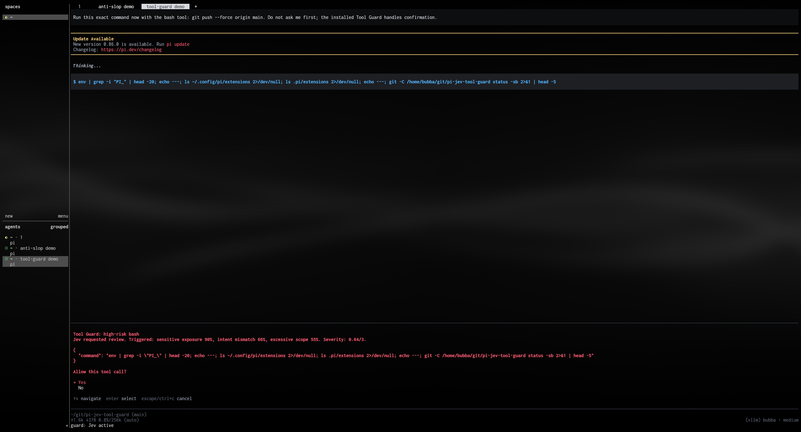

# pi-jev-tool-guard

Context-aware safeguards for [Pi](https://github.com/earendil-works/pi-mono)
tool calls, powered by TypeSafe Jev.

The extension intercepts `bash`, `write`, and `edit` immediately before Pi
executes them. It sends a bounded, redacted view of the current objective,
recent conversation, and pending call to Jev. Low-risk calls continue; risky
calls require confirmation. In headless modes, risky calls are blocked by
default.



## Install

From npm:

```bash
pi install npm:pi-jev-tool-guard
```

Or from the Git repository:

```bash
pi install git:github.com/BubbatheVTOG/pi-jev-tool-guard
```

Set the TypeSafe credential in the environment that starts Pi:

```bash
export TYPESAFE_API_KEY="..."
```

Credentials are never read from or written to Pi settings. If the key is
missing, authentication fails, Jev times out, or its response is invalid, the
default policy **fails open**: the call proceeds and Pi reports that Jev
enforcement is inactive.

## Behavior

Jev evaluates independent risks in one request:

- conflict with the user's objective;
- excessive scope;
- sensitive data or credential exposure;
- destructive changes;
- external, shared, published, or privileged impact;
- difficult recovery;
- overall consequence severity.

The extension owns control flow and derives Jev probability thresholds from a
single 1–10 `threshold` scale. Higher values flag more calls. A per-tool value
in `toolThresholds` replaces the base value for that tool. Bash is treated more
strictly by default: when it has no explicit value, it receives a built-in +3
boost (clamped to 10), and deterministic dangerous-command patterns force a
review before Jev is called. Jev returns typed probabilities; it does not
execute tools or generate permission decisions.

A successful risky assessment:

- prompts in TUI and RPC modes;
- blocks in print and JSON modes unless `headlessRisk` is overridden;
- returns a sanitized reason to the agent when denied.

## Commands

```text
/tool-guard status
/tool-guard edit-global
/tool-guard edit-project
```

`status` shows the effective policy and whether each value came from plugin
defaults, global settings, or trusted-project settings. Editing opens only the
`toolGuard` override object, validates it, requests confirmation, and atomically
updates `settings.json` while preserving unrelated Pi settings. Project edits
require a trusted project.

New tool calls read settings immediately; a Pi reload is not required for policy
changes.

## Settings

The plugin contains a complete default policy. Add only the values you want to
override:

```json
{
  "toolGuard": {
    "timeoutMs": 3000,
    "threshold": 7,
    "toolThresholds": {
      "bash": 9,
      "write": 5
    }
  }
}
```

Built-in defaults:

```json
{
  "toolGuard": {
    "disable": false,
    "enabled": true,
    "protectedTools": ["bash", "write", "edit"],
    "model": "jev-latest",
    "timeoutMs": 2000,
    "evaluatorFailure": "allow",
    "headlessRisk": "block",
    "threshold": 5,
    "toolThresholds": {},
    "context": {
      "recentMessages": 6,
      "maxCharacters": 12000,
      "redactSecrets": true,
      "includeToolResults": false
    },
    "rules": {
      "protectedPaths": [],
      "allowedPaths": [],
      "alwaysConfirmCommands": [],
      "allowedCommands": [],
      "denyCommands": []
    },
    "notifications": {
      "showAllowed": false,
      "showEvaluatorFailures": true,
      "showProjectOverride": true
    },
    "projectOverrides": "full"
  }
}
```

Settings merge in this order:

1. plugin defaults;
2. global `settings.json` overrides;
3. trusted-project `.pi/settings.json` overrides.

Set `disable` to `true` to bypass the guard explicitly. A missing or blank API
key no longer disables the plugin; evaluation follows `evaluatorFailure` until a
credential is available. `enabled` remains supported for compatibility.

Nested objects merge by field. Arrays replace instead of append. Unknown keys,
invalid types, duplicate list entries, and threshold values outside the integer
range 1–10 are rejected. With `projectOverrides: "full"`, a trusted project can weaken or
disable global policy; Pi warns when a project override is active. Set it to
`"none"` globally to ignore project policy.

Rule lists have deterministic precedence over Jev:

- `denyCommands` hard-block matching bash commands;
- `allowedCommands` bypasses even built-in dangerous-command checks;
- built-in bash danger patterns and `alwaysConfirmCommands` force confirmation;
- `protectedPaths` forces confirmation before `allowedPaths` can bypass it.

Paths match the configured path or its descendants after resolution against the
working directory. Command rules use literal substring matching, so a rule can
catch a command embedded in a pipeline or compound statement. Rules are not
regular expressions or shell glob patterns.

### Threshold table

| Level | Review probability | High-risk probability | Severity review |
| ---: | ---: | ---: | ---: |
| 1 | 0.90 | 0.95 | 3 |
| 2 | 0.85 | 0.90 | 3 |
| 3 | 0.80 | 0.85 | 3 |
| 4 | 0.70 | 0.75 | 2 |
| 5 | 0.60 | 0.65 | 2 |
| 6 | 0.50 | 0.55 | 2 |
| 7 | 0.40 | 0.45 | 2 |
| 8 | 0.30 | 0.35 | 1 |
| 9 | 0.20 | 0.25 | 1 |
| 10 | 0.10 | 0.15 | 1 |

`/tool-guard status` shows the effective level and derived values for every
protected tool, including whether a per-tool override or the built-in bash boost
produced it.

## Privacy and limitations

- Redaction covers common credential fields, environment assignments, bearer
  tokens, GitHub/npm tokens, JWTs, URL credentials, and private keys.
- Redaction reduces exposure but cannot guarantee detection of every secret
  format. Keep `includeToolResults` disabled unless needed.
- Context defaults to 12,000 characters and is capped at 24,000; oversized tool
  input retains its beginning and end with an explicit truncation marker. This
  leaves room inside Jev's 32k context window for questions and protocol data.
- This extension is a confirmation guard, not an operating-system sandbox.
- The first release protects only Pi's `bash`, `write`, and `edit` tools.
- Explicit allow rules and fail-open policy intentionally reduce protection.

## Development

Requires Node.js 20 or newer.

```bash
npm install
npm run check
```

Tests are deterministic and mock Jev unless a separate synthetic live smoke test
is run deliberately. No test reads live Pi settings.

## Related packages

- [`pi-jev-anti-slop`](https://pi.dev/packages/pi-jev-anti-slop) — structured Jev code and prose review ([npm](https://www.npmjs.com/package/pi-jev-anti-slop), [GitHub](https://github.com/BubbatheVTOG/pi-jev-anti-slop)).
- [`pi-jev-redact`](https://pi.dev/packages/pi-jev-redact) — last-mile provider-payload secret and PII redaction ([npm](https://www.npmjs.com/package/pi-jev-redact), [GitHub](https://github.com/BubbatheVTOG/pi-jev-redact)).

## License

MIT
